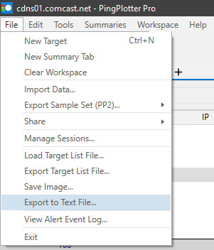
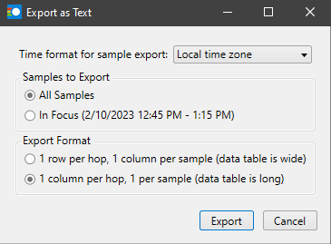

# pingplotter-csv-graph

This repository contains two python scripts that can take .csv exports from [PingPlotter](https://www.pingplotter.com/) and graph them using the [Plotly](https://github.com/plotly/plotly.py) graphing library.

To run this script, simply run `python3 gui.py` and select the PingPlotter .csv export you want to graph.

> **Note**: The free version of PingPlotter does not support .csv exports, but there is a free 14 day trial of PingPlotter Premium when you first install the application.

## Required Script Setup

Before running the script, there are two things you must do to setup the script; installing the Python package dependencies and exporting your PingPlotter capture into a .csv file.

### Python Package Installation

This is a rather easy step to do but can require some extra steps if you are on a non-Windows OS.

For Windows, simply run `python3 -m pip install -r requirements.txt -U` to install/upgrade all the packages this script uses.

For MacOS (which is only supported by PingPlotter Professional & Cloud), first [browse to this page](https://www.python.org/download/mac/tcltk/) and look if you have a new enough version of Python that **HAS BEEN DOWNLOADED FROM PYTHON.ORG**.  The Apple supplied version of Python seems to be generally buggy with tkinter applications.  After ensuring that you have a version of Python that works with tkinter, run `python3 -m pip install -r requirements.txt -U`.

For Linux (which is only supported by PingPlotter Cloud), first run `sudo apt install python3-tk` to install the tk GUI dependencies.  After that finishes installing, run `python3 -m pip install -r requirements.txt -U`.

You can check to make sure that tkinter is working properly by running `python3 -m tkinter`.  If a small window appears letting you know what version you have installed, then tkinter is working properly.

### Exporting CSV from PingPlotter

As I said earlier, the free version of PingPlotter does not support .csv exports.  However, there is a free 14 day trial of PingPlotter Premium when you first install the application.

After capturing whatever ping data you want, first navigate to *File* | *Export to Text File...*

Then select either <ins>**Local time zone**</ins> or <ins>**UTC time zone**</ins> for the time format.  You **CANNOT** select <ins>**Don't include times**</ins> for the time format as the x-axis of the graph uses these times.  For *Samples to Export*, you can select either <ins>**All Samples**</ins> or whatever range you have currently in focus.  Lastly and most important, for the *Export Format* select <ins>**1 column per hop, 1 per sample (data table is long)**</ins>.  This script will not work with the other export format.

After all of this has been done, you should be able to run `python3 gui.py` which should open a file selection window for you to select your .csv export.